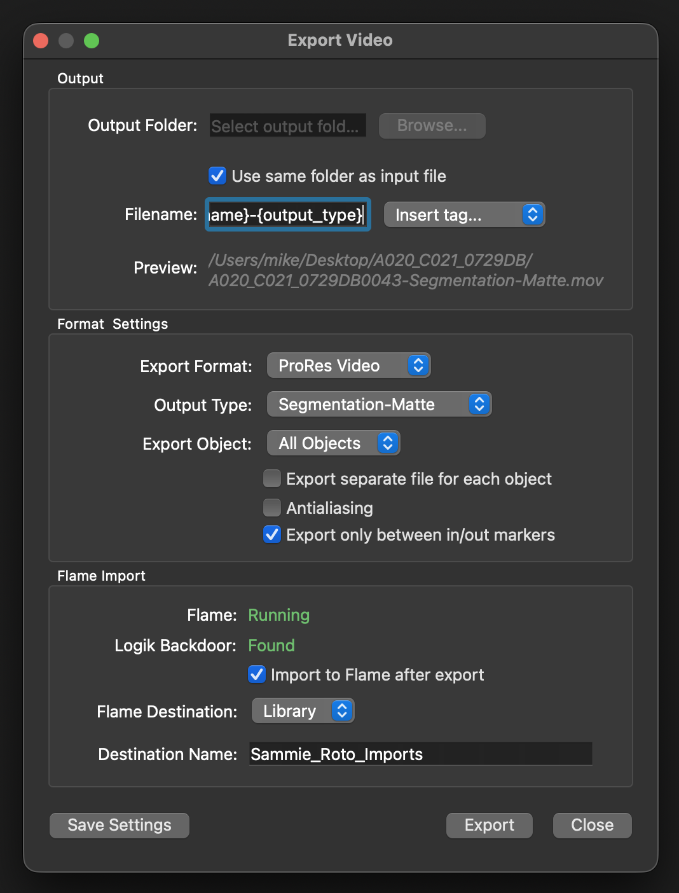

# Sammie Roto Flame Export

Adds a **Flame Export** option to Sammie Roto's export windows, so an exported
matte drops straight into a running Autodesk Flame or Flare session — into a
Library or the open Batch — the moment the export finishes.



## Requirements

- **Sammie Roto 2.4.1 or later** (the installer refuses older versions).
- **Autodesk Flame or Flare 2025.2 or later.**
- **Logik Backdoor 1.0.0 or later**, installed in your Flame — see below. This
  is required; the import talks to Flame through it.

For **macOS and Linux**. So far it has only been tested on macOS.

## Logik Backdoor (required first)

This integration does not talk to Flame directly. It relies on **Logik
Backdoor**, a small bridge that runs inside Flame. Install that first:

- Download it from the **Logik Portal** website:
  <https://logik-portal.com/scripts/logik_backdoor>, or
- Get it from the **Logik Portal** app inside Flame
  (Flame main menu → **Logik → Logik Portal**), listed under the Python scripts.

Follow Logik Backdoor's own install instructions. Once installed it loads
automatically every time Flame or Flare starts — nothing else to launch. By
default it lives at `/opt/Autodesk/shared/python/logik_backdoor`, which is the
path the installer offers by default.

## Install

**macOS:** double-click `install.command`.

**Linux / terminal:** run
 
```bash
python3 install.py
```

The installer asks for:

1. Your **Sammie Roto** folder (press Return to accept the default
   `/Applications/Sammie-Roto-2`).
2. Your **Logik Backdoor** folder (press Return to accept the default
   `/opt/Autodesk/shared/python/logik_backdoor`).

It then adds a `sammie_roto_flame_export.py` module to Sammie and patches its two export
dialogs. **Restart Sammie Roto** to see the new options.

Nothing is lost if you change your mind — the installer backs up each dialog
before touching it.

### Updating

Sammie updates overwrite the patched dialogs. Just **re-run the installer** — it
detects an earlier install and re-applies the current version cleanly. No need to
uninstall first.

Upgrading from the earlier *Sammie Roto Flame Import* works the same way: the
installer removes its old `flame_import.py` module and carries your remembered
choices over to the new settings file.

### Uninstall

```bash
python3 install.py --uninstall
```

This restores Sammie's original dialogs and removes the added module.

## Using it

In Sammie's **Export Video** or **Export Image** window, a **Flame Export**
section appears at the bottom:

| Field | What it shows / does |
| --- | --- |
| **Flame** | `Running (version)` when a Flame/Flare session is open, else `Not running`. |
| **Logik Backdoor** | `Found` when the bridge is installed, else `Not found`. |
| **Import to Flame after export** | Tick to import automatically when the export finishes. |
| **Flame Destination** | `Library` (a Media Panel library) or `Batch` (a reel in the open Batch). |
| **Destination Name** | Name of the library or reel to import into. Created if it does not exist. |

Tick the box, choose the destination and name, and export as usual. When the
export completes, the clip lands in Flame and a confirmation appears.

- Works with **video files** (ProRes / mp4) and **image sequences** (PNG, EXR).
- The whole section **greys out** unless both Flame/Flare *and* Logik Backdoor
  are detected — so you can only tick it when it will actually work.
- Your last choices (checkbox, destination, name) are **remembered** between
  exports.
- With Flame and Flare both open, the import targets the most recently started
  session — the one named in the status line.

## Notes

- The integration uses Logik Backdoor's typed import tools — it only ever reads
  Flame state and adds media, never runs arbitrary code.
- The patched files live inside the Sammie app, so a Sammie reinstall or update
  needs the installer re-run (see *Updating*).

## License

GPL-3.0-or-later.
